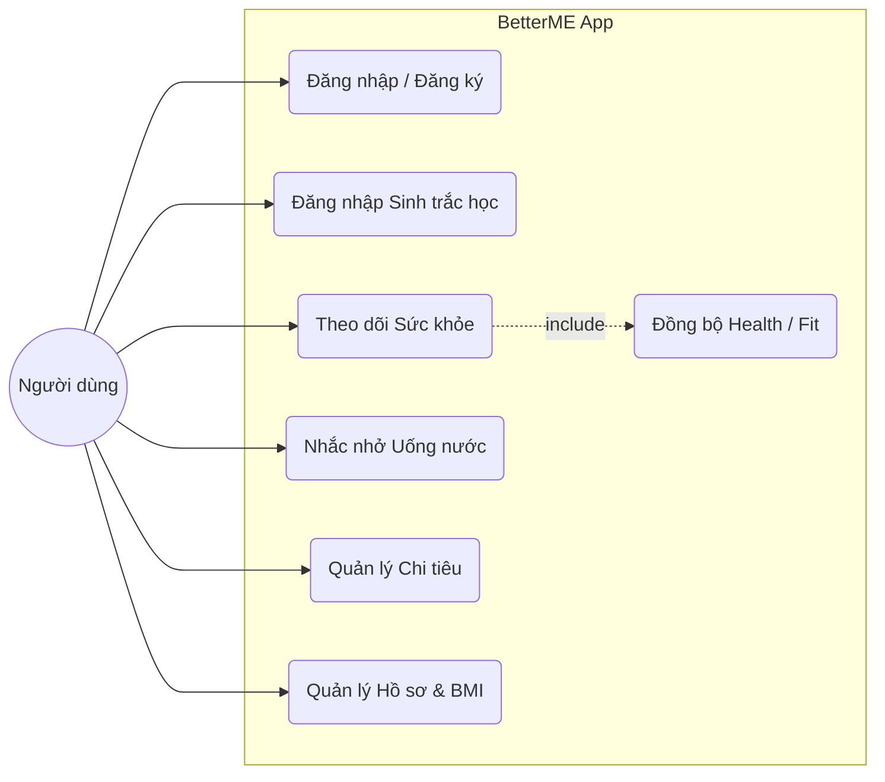
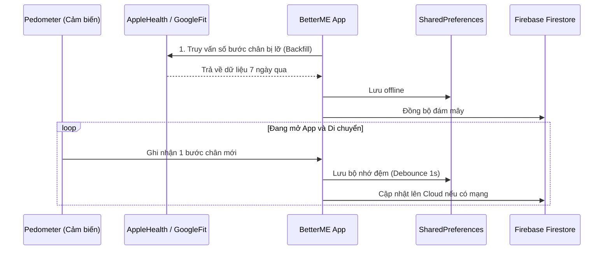

# GIAI ĐOẠN 3: THIẾT KẾ MÔ HÌNH CHỨC NĂNG VÀ GIAO DIỆN

## 1. Thiết kế mô hình chức năng (Functional Design)

Hệ thống ứng dụng **BetterME** được thiết kế hướng tới việc trở thành một trợ lý ảo cá nhân toàn diện trên thiết bị di động, tập trung vào việc quản lý sức khỏe, thói quen uống nước và theo dõi tài chính cá nhân.

### 1.1. Biểu đồ Use Case (Các chức năng chính)
Dưới đây là biểu đồ Use Case mô tả các hành động tương tác chính của người dùng với hệ thống:

### 1.2. Phân hệ Mobile App (Người dùng cuối)
Ứng dụng di động (phát triển bằng **Flutter**) tích hợp các bộ công cụ theo dõi cảm biến cục bộ và đồng bộ đám mây, bao gồm các chức năng cốt lõi sau:

**1. Xác thực và Bảo mật (Authentication & Security):**
- Đăng ký, Đăng nhập bằng Tài khoản/Mật khẩu hoặc Email.
- Hỗ trợ đăng nhập nhanh bằng nền tảng **Google Sign-In**.
- Tích hợp đăng nhập nhanh bằng **Sinh trắc học** (FaceID/TouchID) sử dụng `local_auth`.

**2. Quản lý Sức khỏe (Health Tracking):**
- **Đếm bước chân thời gian thực** (Pedometer) sử dụng cảm biến thiết bị.
- Đồng bộ hóa dữ liệu với **Apple Health** (iOS) và **Health Connect** (Android).
- Theo dõi giấc ngủ, cân nặng và tự động tính toán, phân loại chỉ số **BMI**.
- Hệ thống AI/Logic tự động đưa ra các lời khuyên sức khỏe dựa trên các chỉ số cá nhân.

**3. Nhắc nhở Uống nước (Water Reminder):**
- Tính toán mục tiêu nước mỗi ngày dựa trên cân nặng người dùng (VD: 33ml x Cân nặng).
- Thêm nhanh lượng nước theo các dung tích chuẩn (100ml, 250ml,...).
- Đồ thị theo dõi trong ngày.

**4. Quản lý Chi tiêu (Expense Tracking):**
- Ghi chép các khoản thu/chi hàng ngày.
- Phân loại theo hạng mục (Ăn uống, Giải trí, Hóa đơn,...).
- Thống kê sinh động bằng biểu đồ tròn trực quan.

**5. Đồng bộ Đám mây (Cloud Sync):**
- Toàn bộ dữ liệu (Sức khỏe, Uống nước, Chi tiêu, Sinh nhật) được lưu trữ offline qua `SharedPreferences` và tự động đồng bộ (Backfill) lên mây (Firebase Cloud Firestore).

### 1.3. Biểu đồ Luồng dữ liệu Đồng bộ (Data Flow)
Mô tả cách ứng dụng đếm bước chân và lưu trữ luân phiên giữa ngoại tuyến và trực tuyến:

---

## 2. Giao diện ứng dụng thực tế (UI Design)

Ứng dụng ứng dụng thiết kế **Watercolor Theme** với dải màu Gradient (Xanh lam - Xanh ngọc) chủ đạo, phong cách tinh tế, hiện đại, hỗ trợ hiệu ứng bóng mờ (Glassmorphism) và hoạt ảnh dạng sóng nước.

### 2.1. Giao diện Màn hình Đăng nhập (Login/Register)
- **Mô tả:** Màn hình xác thực với cấu trúc thiết kế Clean UI, nền tối điểm xuyết các đốm sáng xanh (glow effects). Tích hợp các Form nhập liệu có Validate và Nút Đăng nhập sinh trắc học tích hợp.
- **Hình ảnh thực tế:**
  > *(Chèn ảnh chụp màn hình Đăng nhập tại đây: Chú thích 2.1 - Màn hình Xác thực người dùng, Form nhập Tài khoản)*

### 2.2. Giao diện Màn hình Trang chủ (Home)
- **Mô tả:** Nơi tổng hợp nhanh các tiến độ trong ngày của người dùng. Hình nền ứng dụng là một hệ thống Animation động (Ripple Effects / Sóng nước) có thể thay đổi trạng thái tuỳ thuộc vào tab nội dung.
- **Hình ảnh thực tế:**
  > *(Chèn ảnh chụp màn hình Home tại đây: Chú thích 2.2 - Giao diện Tổng quan Trang chủ)*

### 2.3. Giao diện Màn hình Sức khỏe (Health Insight)
- **Mô tả:** Hiển thị số bước chân theo biểu đồ cung tròn (Circular Progress), đo đạc số km và lượng Calories tiêu thụ tương ứng. Đi kèm là các thẻ (Card) ghi chép Giấc ngủ và Cân nặng. 
- **Hình ảnh thực tế:**
  > *(Chèn ảnh chụp màn hình Health tại đây: Chú thích 2.3 - Màn hình Thống kê Sức khỏe Bước chân & BMI)*

### 2.4. Giao diện Màn hình Theo dõi Uống nước (Water Tracking)
- **Mô tả:** Giao diện với khối nước dâng lên theo tỷ lệ phần trăm lượng nước đã uống. Hiển thị lịch sử các lần uống nước trong ngày theo Timeline dọc. 
- **Hình ảnh thực tế:**
  > *(Chèn ảnh chụp màn hình Water tại đây: Chú thích 2.4 - Màn hình Bổ sung nước và Lịch sử uống)*

### 2.5. Giao diện Màn hình Chi tiêu (Expense Manager)
- **Mô tả:** Màn hình tích hợp biểu đồ tròn (Pie Chart) thống kê các hạng mục chi tiêu lớn, nút bấm rực rỡ mở ra Form nhập dữ liệu thu chi tiện lợi và nhật ký giao dịch hiển thị bên dưới.
- **Hình ảnh thực tế:**
  > *(Chèn ảnh chụp màn hình Chi tiêu tại đây: Chú thích 2.5 - Quản lý Chi tiêu cá nhân hàng ngày)*
